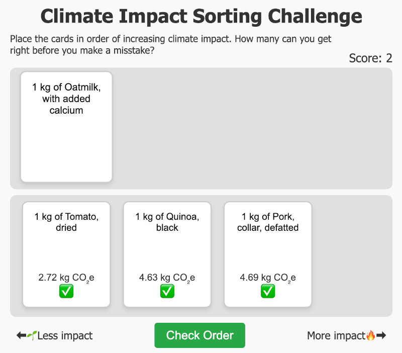

Sorting challenge template
===============================

This repo contains a HTML template to easily create a small (one HTML file) game 
that asks you to place a number of cards in order. Like in [this example](https://www.sumsar.net/climate-impact-sorting-challenge/), where your
task is to sort the food items by their climate impact.

How do I make a game like this, using the template? Check out `create-example-sorting-game.R` that shows 
you how to fill in a tempate here. Even if you don't know R, you can probably figure out how to do it in another language.

Main files in this repo:

* `template-sorting-challenge.html`: The HTML template for the game, which uses `{{` `}}` to delimit the template variables.
* `create-example-sorting-game.R`: An R that fills in the template to creates a minimal sorting game.
* `example-sorting-game.html`: The resulting example sorting game.
* `sorting-challenges`: Some other example sorting games.